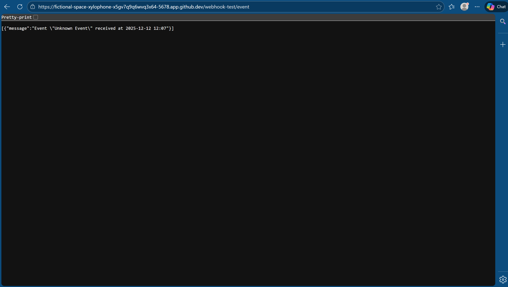

## Step 1: A newly created, properly named workflow.

  
  
## Step 2 and 3: Add a webhook and code node

  

  
## Step 4: Add a respond to webhook node

  
## Step 5: Testing the workflow results

  
