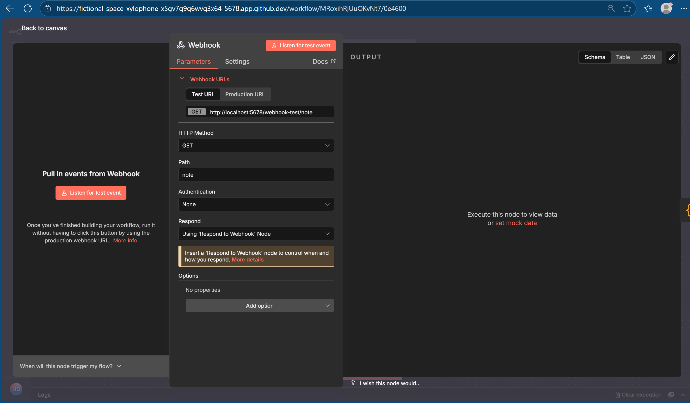
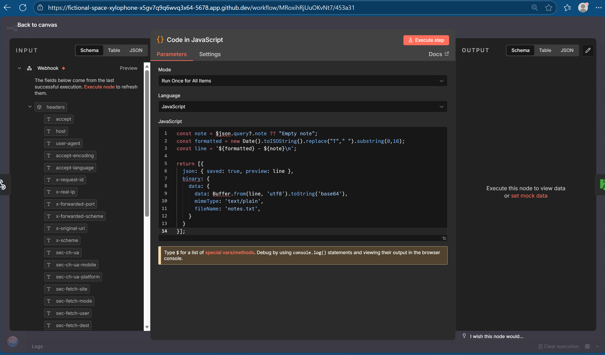
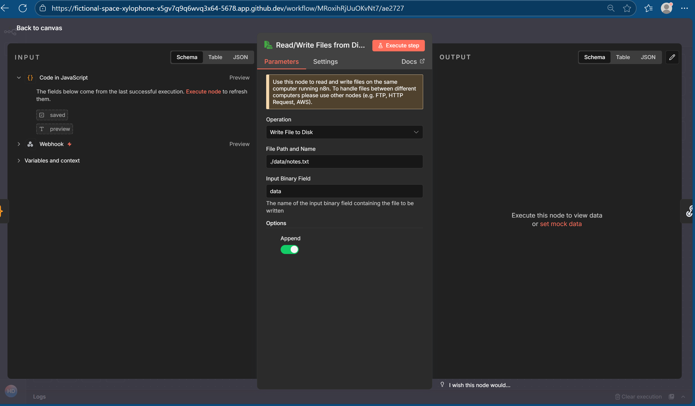
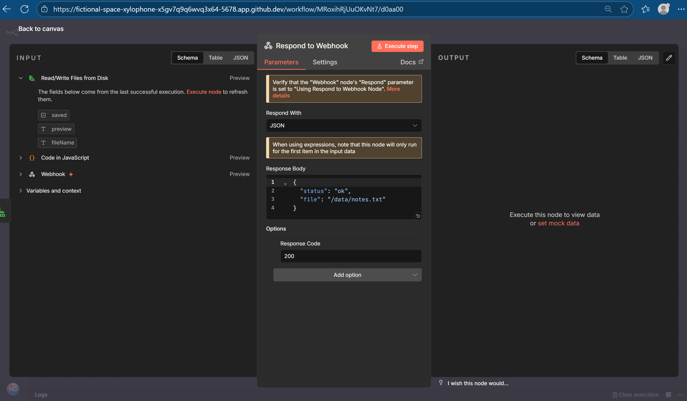

## Step 1: Create a new workflow

  
## Step 2: Add a webhook node

  
## Step 3: Add Java code node

  
## Step 4: Add a write binary file node

  
## Step 5: Add a respond webhook node

  
## Step 7: Verify in codespace

